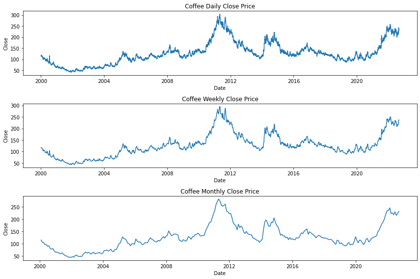
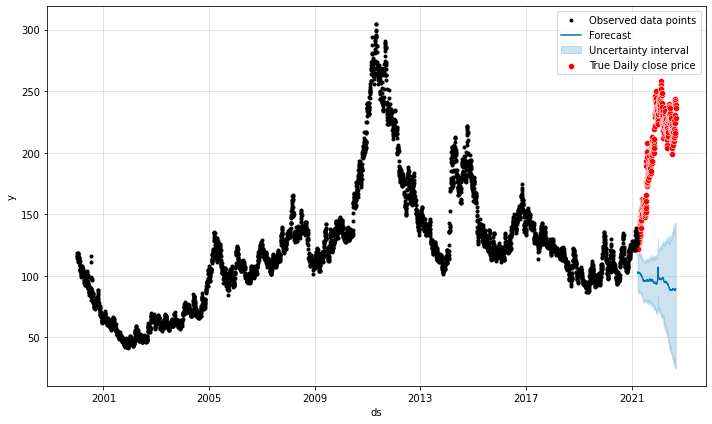
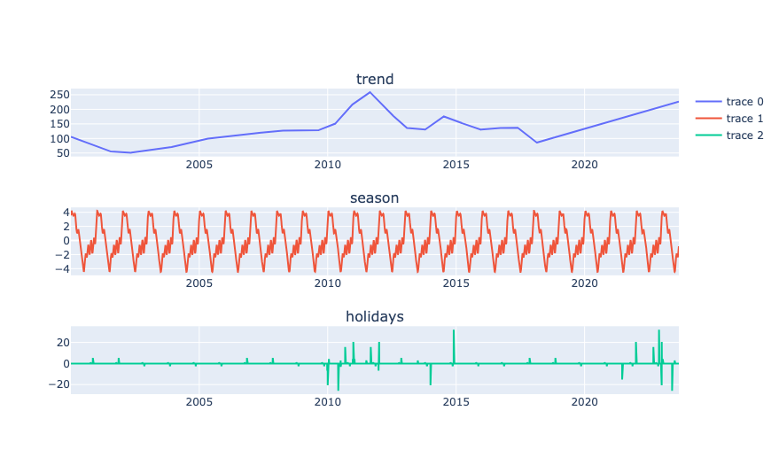
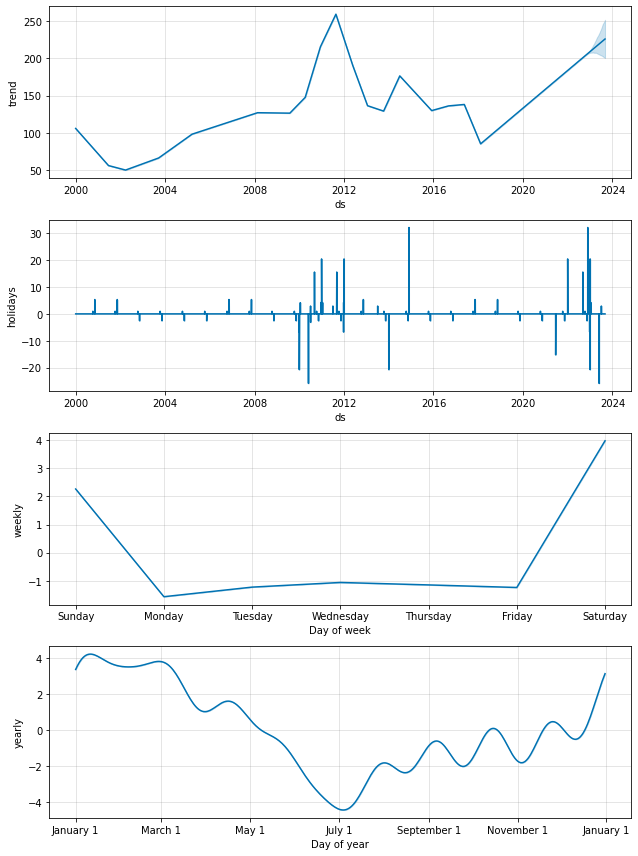

# Coffee-stock-price-forecast-with-Prophet
- [Project Goal](#Project-Goal)
- [Installation](#Installation)
- [File Descriptions](#File-Descriptions)
- [Instructions](#How-To-Run-This-Project)
- [EDA](#EDA)
- [Forecasting Model](#Model)
- [Licensing, Authors, Acknowledgements](#License)

## Project Goal 
The project's goal is to predict the closing price for coffee stock over 365 days using the Facebook Prophet algorithm to forecast time series data.

**Background:** The given dataset contained coffee stock prices from 2000 to 2022

## Installation 
The following packages and versions are used in this notebook. No specific versions are required for the code to work
| Package  | Version |
| ------------- | ------------- |
| Python  | 7.12.0 |
| Pandas  | 1.3.5  |
| Seaborn | 0.11.2 |
| Numpy   | 1.21.6 |
| Matplotlib | 3.5.2|

## File Description 
There are 2 files in this repository.  
A Jupyter notebook `.ipynb` entails the analysis.  
A README.md file as a brief look at this repository.

## Instructions 
* Execute the codes in this notebook and follow along with the insights to understand the decisions made throughout the process.
* This project can also be found in my Kaggle account [post](https://www.kaggle.com/code/azeotrope/coffee-stock-price-forecasting-with-prophet)

## EDA 
The dataset records daily coffee stock prices without missing data. Below is the visualization of the closing price daily, weekly, and monthly.

 
Figure 1. The coffee closing price is daily, resampled weekly, and monthly. The price range is from 2000 to 2022. 

Overall, the coffee stock price is stable as coffee is one of the most-demand products in the world. However, there was a sharp increase in its price during 2011-2012, 2014-2015, and 2021

## Forecasting Model 

I used the Facebook Prophet model as the forecasting model in this project. The data frame used for the model included the feature "Date" and the target column "Close".
The dataset was split into train-test sets in which the test set contains the last 365 days.
- train_set = df[:-365]
- test_set = df[-365:]

The model incorporates annual seasonality and US holidays in its analysis. 

 
Figure 2. Observed stock prices from 2000-2020 (black), 2021 (red), and stock prices of the last 365 days of the dataset predicted by the model (blue). 

From the chart above, the model is under-forecast. 
- The forecast for the daily close price over the period of the last 365 days (solid blue line) is significantly far off from the true close price (red line).
- This indicates that the data can be influenced by other features leading to a very low accuracy prediction

 
Figure 3. Applying the model to the whole original dataset to forecast the closing price of the future 365 days. 

Picking up from the last date of the original dataset, the model made a prediction of the coffee closing price for the next 365 days (into 2023) with the upward trend indicating the price would be high. 

 
Figure 4. Trend and seasonality components of the coffee stock price with the forecast price of the next 365 days. 

Within a year (seasonality), coffee price usually drops in May and picks up again in late July (yearly vs. Day of year)

## Conclusion 
Although the model poorly predicted the coffee price for 2021-2022, it can be explained due to unexpected factors. Brazil, one of the largest coffee farms that provided 35% of coffee beans worldwide, suffered poor weather, drought, and frost seasons, as well as the continuous freight cost and supply chain issues resulting from COVID-19.
## Licensing, Authors, Acknowledgements 
* The data set, licensing, and other descriptive information are described here [Kaggle](https://www.kaggle.com/datasets/psycon/daily-coffee-price)
